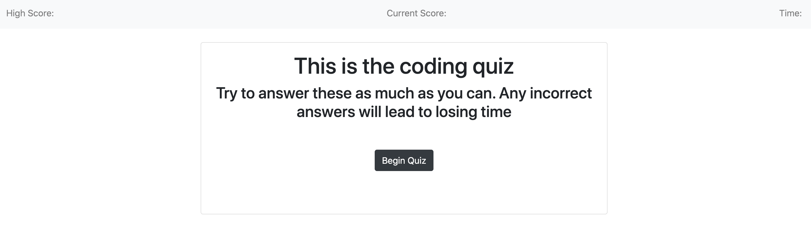
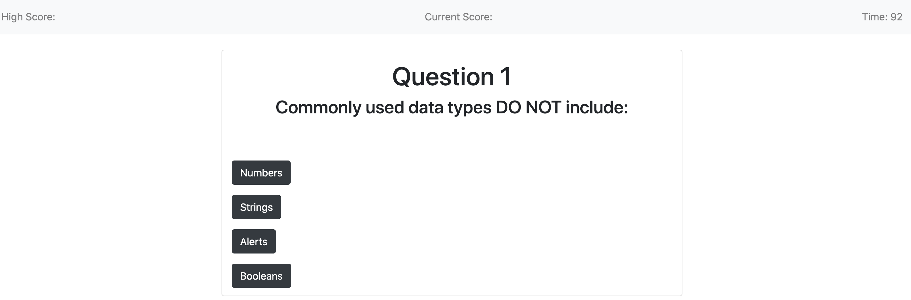
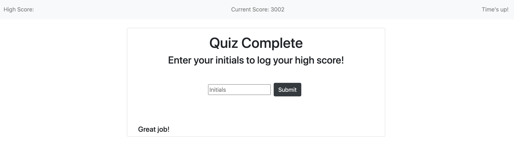
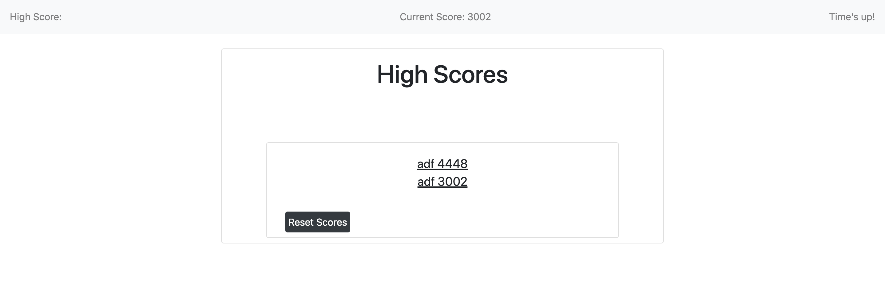

# code-quiz-game

For this project, I built a simple quiz app which uses DOM manipulation to change the content on the page. 
In order to successfully complete this quiz, we needed to employ some of the techniques we learned throughout the week including looping, using query selectors, adding event listeners and manipulating objects via the DOM.

By building this project, I was able to gain valuable experience dynamically updating the page by adding and removing classes and style attributes. Additionally, we were required to use local storage for the first time. 

I faced a number of challenges in building the quiz that you see and could readily identify numerous areas of improvement. Ultimately, it was a great exercise in pushing through problems to build a working product. 

Moving forward, I would work to refactor the project to contain more DRY code, shuffle the questions and answers so that they do not appear in the same order, adjust the High Score page to display the highest score at the top, and to appropriately update the high score in the navbar. 

Please see our User Story and Acceptance Criteria below.

## User Story

AS A coding bootcamp student
I WANT to take a timed quiz on JavaScript fundamentals that stores high scores
SO THAT I can gauge my progress compared to my peers

## Acceptance Criteria

GIVEN I am taking a code quiz
WHEN I click the start button
THEN a timer starts and I am presented with a question
WHEN I answer a question
THEN I am presented with another question
WHEN I answer a question incorrectly
THEN time is subtracted from the clock
WHEN all questions are answered or the timer reaches 0
THEN the game is over
WHEN the game is over
THEN I can save my initials and score

## Images

### Starting Page

### Dynamically Displayed Page

### Dynamically Displayed Final Page

### Dynamically Displayed Final Page

## Credits

During the creating of this project, I collaborated with a number of my fellow classmates and consulted resources including, https://developer.mozilla.org, https://stackoverflow.com, and https://w3schools.com.

## Links
[Project Webpage](https://ad-fleming.github.io/code-quiz-game/)

[Repository Link](https://github.com/ad-fleming/code-quiz-game)